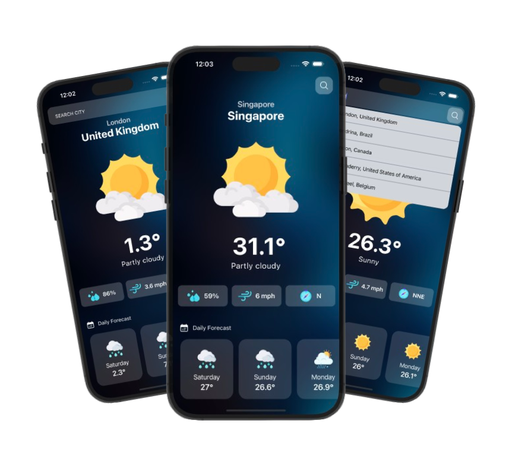

# 🌦 React Native Weather App

An intuitive weather application developed with **React Native**, designed to provide real-time weather updates. Styled using **TailwindCSS (Nativewind)**, this app is fully responsive and works seamlessly across Android and iOS devices.

----------

## 🚀 Features

-   **Real-Time Weather Updates**: Retrieves accurate weather data via a free weather API.
-   **Responsive Design**: Offers a clean, user-friendly interface optimized for different screen sizes.
-   **TailwindCSS Integration**: Utilizes Nativewind for streamlined styling.
-   **Cross-Platform Functionality**: Compatible with both Android and iOS platforms.

----------

## 🛠️ Technologies Used

-   [**React Native**](https://reactnative.dev/docs/environment-setup): Framework for building the mobile app.
-   [**Nativewind (TailwindCSS)**](https://www.nativewind.dev/getting-started/react-native): For responsive and easy styling.
-   [**Weather API**](https://www.weatherapi.com/docs/): Fetches real-time weather data from a free API.
-   [**Expo**](https://docs.expo.dev/versions/latest/config/babel/): Facilitates easy development and testing.

### Libraries

-   [Hero Icons](https://www.npmjs.com/package/react-native-heroicons): Provides scalable and customizable icons.
-   [Progress](https://www.npmjs.com/package/react-native-progress): Displays progress indicators.
-   [Async Storage](https://www.npmjs.com/package/@react-native-async-storage/async-storage): Handles local persistent storage.

----------

## 📦 Installation

1.  **Clone the Repository**:
    
    ```bash
    git clone https://github.com/sai-zack-dev/weather-native-app.git
    cd weather-native-app
    
    ```
    
2.  **Install Dependencies**:
    
    ```bash
    npm install
    
    ```
    
    or
    
    ```bash
    yarn install
    
    ```
    
3.  **Configure the API Key**:
    
    -   Create a `.env` file in the root directory:
        
        ```plaintext
        API_URL=https://api.example.com
        API_KEY=your_api_key_here
        
        ```
        
    -   Replace `your_api_key_here` with your key from the weather API provider.
4.  **Launch the Development Server**:
    
    ```bash
    npx expo start
    ```
    

----------

## 📱 Usage

1.  **Run the App on Android/iOS**:
    
    -   For Android:
        
        ```bash
        a
        ```
        
    -   For iOS:
        
        ```bash
        i
        ```
        
2.  **Explore App Features**:
    
    -   Input a city name to view detailed weather data.
    -   Access real-time temperature, conditions, and more.

----------

## 🌈 Preview

<div align="center">
  
</div>

----------

## 📧 Contact

For any questions or feedback, feel free to get in touch:

-   **Email**: [saizlinh@gmail.com](mailto:saizlinh@gmail.com)
-   **GitHub**: [Sai Zack](https://github.com/sai-zack-dev)
